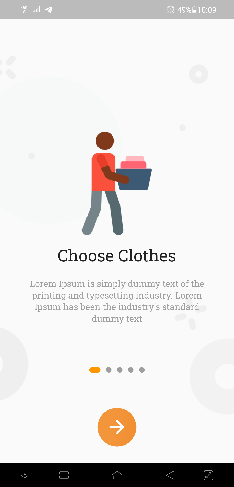
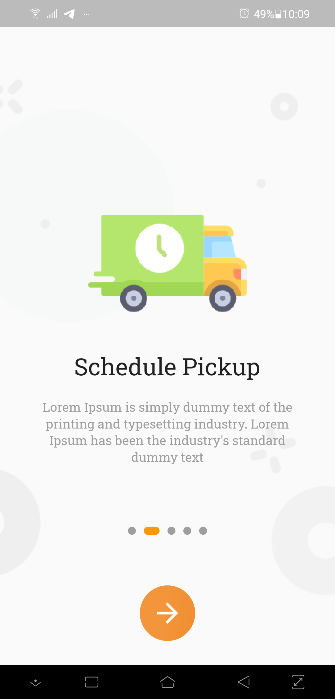

# Iron Yard
**Iron Yard**: An android cloth ironing **user interface** built in flutter.
  

    

  

> If you found this project helpful or you learned something from the source code and want to thank me, please drop a star.

  

> [Download App](outputs/ironyard.apk)

  

> A glimpse of **Iron Yard** is shown in following screenshots.

  

 ## Splash Screen 
 

    

  

## Onboarding Screen 
<table>
  <tr>
    <td>Onboarding 1</td>
     <td>Onboarding 2</td>
     <td>Onboarding 3</td>
      <td>Onboarding 4</td>
  </tr>
  <tr>
    <td></td>
    <td></td>
    <td></td>
       <td></td>
  </tr>
 </table>
  

